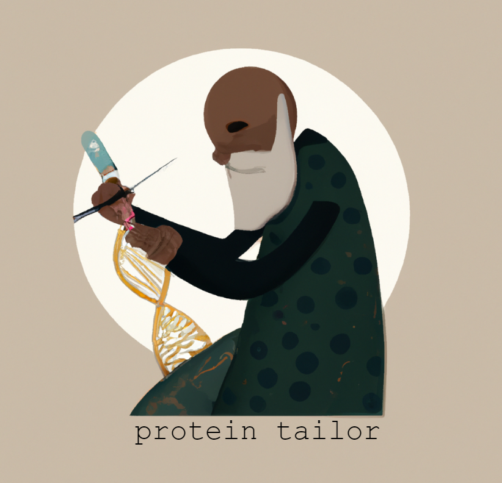
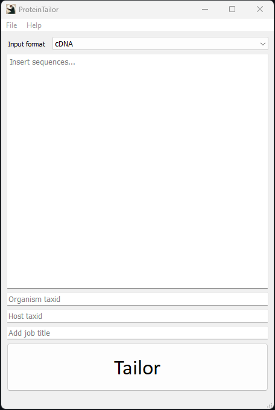

# ProteinTailor 

Program that tailors exogenous proteins to make them viable and optimised for expression in _Escherichia coli_.

## Installation

To install the project, follow these steps:

1. Clone the repository: `git clone https://github.com/ndreey/ProteinTailor.git`
2. Install the dependencies manually or use: `pip install -r requirements.txt` (Note, _requirments.txt_ must be located in the working directory)

Successful installation and run is confirmed in Windows 11. MAC and Linux users, be aware that ProteinTailor will run into some issues loading the ProteinTailor Report automatically as the path finder function was developed for a Windows OS.

## User Manual 
After main.py has been executed the ProteinTailor GUI will appear. With the drop down menu one can select the input format.
- cDNA
- mRNA
- amino acid sequence (aa-seq)
- [Uniprot accession](https://www.uniprot.org/) 

ProteinTailor is able to process inputs in either **FASTA** format or as a pure sequence, though it is important to note that this version is limited to handling a single input at a time. The NCBI taxonomic identifier (taxid) for both the organism from which the protein originates and the _E. coli_ strain must be entered in order to utilize ProteinTailor. It is recommended to provide a unique job title for each tailor session, as the ProteinTailor report will be overwritten for each new session. The "Tailor" button initiates the tailoring process, after which the ProteinTailor HTML report will be automatically opened in a new tab of your web browser. The HTML report can be saved from this location. ProteinTailor allows for the creation of additional tailor processes by modifying the input and pressing "Tailor" again.

The report will state the **Job Title** and provide the **Tailored Sequence**. In the **Mirror Check** the raw sequence and tailored sequence are compared (NOT ALIGNED). The **Statistics Table** will hold the Codon Adaptation Index (CAI), GC-content, length of sequence, number of unviable codons and number of codons that were tailored. Further, two plots will be displayed showing the GC-distribution (across 150bp) of the raw and tailored sequence.

[ProteinTailor Report Example](https://rawcdn.githack.com/ndreey/ProteinTailor/c4516952e0cfa06ca02b79a62602e87014fb0fba/docs/ProteinTailor_Report.html)

## How it works
ProteinTailor tailors the sequence through four steps.
1. **Input**: If a Uniprot accession is provided, the amino acid sequence is retrieved using the Uniprot API. Regardless of the input type, the input sequences are converted to mRNA. The [python_codon_tables](https://github.com/Edinburgh-Genome-Foundry/codon-usage-tables/tree/master/python_codon_tables) package is used to store the codon usage tables (CUTs) from the CUT database [kazusa.or.jp](https://www.kazusa.or.jp/codon/) for each taxid.
2. **Codon Tailor**: The sequence is codon optimized by selecting the most frequent codons from the host CUT. If the organism's codon does not exist in the host CUT, the aa is determined using the organism CUT. Then by mapping the aa to the host CUT the most frequent codon is chosen.
3. **Final Fitting**: The sequence is checked for false initations and nonsense mutations introduced by the **Codon Tailor** step. This is done by locating the rouge start and stop codons. False initiations are removed by disrupting Shine-Dalgarno sites that are 6-12bp downstream of start codons. Stop codons in the reading frame are defined as a nonsense mutation and will be stripped from the sequence. Frame shifted stop codons are ignored.
4. **Protein Pickup**: Presents the tailored sequence, "mirror check", statistics and plots using a HTML template and opens a web browser tab to make it possible to interact with the report.

## Version 0.1.0
The current version includes a functional GUI, but has only been tested for use with _E. coli_ or similar prokaryotes as the host on a Windows operating system. It is currently capable of utilizing the algorithm parameters of codon bias, false initiations, and nonsense mutations. Please note that ProteinTailor will be continually updated as the algorithm is developed and its performance is evaluated with different organisms, including eukaryotes.

## File Manifest of protein_tailor/

- main.py: the main program file
- **gui/**: a directory containing the code for the graphical user interface (GUI)
  - __init__.py: An empty file used to mark the gui directory as a Python package.
  - gui.py: The code for the GUI.
- **program/**: a directory containing the protein_tailor.py module which orchestrates the protein tailor program.
  - __init__.py: An empty file used to mark the gui directory as a Python package
  - protein_tailor.py: Code for the ProteinTailor class that utilizes the tailor_tools.
- **tailor_tools/**: A directory containing the code for the tailor tools used by ProteinTailor.
  - __init__.py: An empty file used to mark the tailor_tools directory as a Python package.
  - codon_tailor_tools.py: Code for the codon tailor tools.
  - final_fit_tools.py: Code for the final fit tools.
  - input_tools.py: Code for the input tools.
  - report_tools.py: Code for the report tools.
  - sequence_tools.py: Code for the sequence tools.
  - statistics_tools.py: Code for the statistics tools.
- **temp/**: A directory to store temporary files.
  - mirror.txt: Visual comparision between raw and tailored sequence.
  - ProteinTailor_Report.html: The HTML file presenting the ProteinTailor report.
  - raw_gc.png: Plot of the GC distribution across 150 bases of raw sequence.
  - tailored_gc.png: Plot of the GC distribution across 150 bases of tailored sequence.
- **resources/**: A directory containing resources used by the program.
  - protein_tailor_bg.png: Background image for the ProteinTailor HTML report. 
  - protein_tailor_icon.png: Icon image for the GUI.
