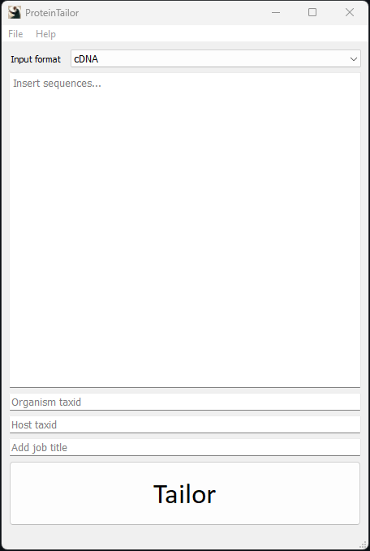

# ProteinTailor 

Program that tailors exogenous proteins to make them viable and optimised for expression in _Escherichia coli_.

## Installation

To install the project, follow these steps:

1. Clone the repository: `git clone https://github.com/ndreey/ProteinTailor.git`
2. Install the dependencies manually or use: `pip install -r requirements.txt` (You must be in the working directory of protein_tailor)

## File Manifest of protein_tailor

- main.py: the main program file
- **gui/**: a directory containing the code for the graphical user interface (GUI)
  - __init__.py: An empty file used to mark the gui directory as a Python package.
  - gui.py: The code for the GUI.
- **program/**: a directory containing the protein_tailor.py module which orchestrates the protein tailor program.
  - __init__.py: An empty file used to mark the gui directory as a Python package
  - protein_tailor.py: Code for the ProteinTailor class that utilizes the tailor_tools.
- **tailor_tools/**: A directory containing the code for the tailor tools used by ProteinTailor.
  - __init__.py: An empty file used to mark the tailor_tools directory as a Python package.
  - codon_tailor_tools.py: Code for the codon tailor tools.
  - final_fit_tools.py: Code for the final fit tools.
  - input_tools.py: Code for the input tools.
  - report_tools.py: Code for the report tools.
  - sequence_tools.py: Code for the sequence tools.
  - statistics_tools.py: Code for the statistics tools.
- **temp/**: A directory to store temporary files.
  - mirror.txt: Visual comparision between raw and tailored sequence.
  - ProteinTailor_Report.html: The HTML file presenting the ProteinTailor report.
  - raw_gc.png: Plot of the GC distribution across 150 bases of raw sequence.
  - tailored_gc.png: Plot of the GC distribution across 150 bases of tailored sequence.
- **resources/**: A directory containing resources used by the program.
  - protein_tailor_bg.png: Background image for the ProteinTailor HTML report. 
  - protein_tailor_icon.png: Icon image for the GUI.

## User Manual 
After main.py has been executed the ProteinTailor GUI will appear. With the drop down menu one can select the input format.
- cDNA
- mRNA
- amino acid sequence (aa-seq)
- Uniprot accesion

ProteinTailor can handle inputs in either **FASTA** format or pure sequence (Note that this version can only handle one input at a time). You are required to enter the NCBI taxid of the organism the protein is derived from and the taxid of the _E. coli_ strain for ProteinTailor to work. It is recommended to add a unique job title for each tailor session as the ProteinTailor Report will be overwritten. By pressing the **Tailor** button ProteinTailor will start the tailor procedure. The ProteinTailor HTML Report will be automatically presented in your webbrowser in a new tab. Here you can store the ProteinTailor HTML Report by saving the HTML file. ProteinTailor is dynamic so you can create a new tailor process by changing the input and press tailor again.

